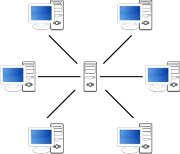
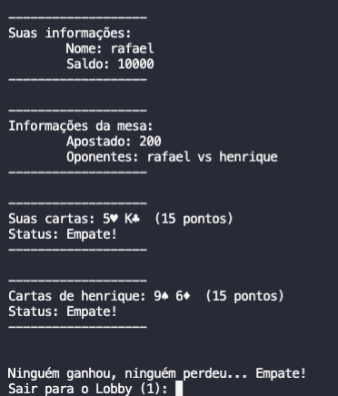
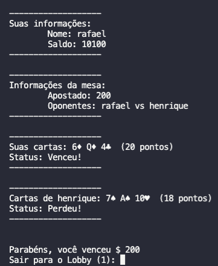

<h1 align="center">Trabalho final de Sistemas Distribuídos<br>Black Jack</h1>
<p href="#descricao" align="center">Trabalho final da disciplina de Sistemas Distribuídos, implementação do jogo de cartas Black Jack utilizando clientes (jogadores) conectados em um servidor. A comunicacao cliente-servidor ocorre utilizando a tecnologia RMI.</p>

<div align="center">
  
</div>


[comment]: <> (<h4 align="center"> )

[comment]: <> (  ✅  Projeto finalizado ✅)

[comment]: <> (</h4>)

Tabela de conteúdos
=================
<!--ts-->
   * [Executando o projeto](#executando-o-projeto)
   * [Descrição de implementação](#descrição-de-implementação)
   * [Bibliotecas Utilizadas](#bibliotecas-utilizadas)
   * [Exemplos de Uso](#exemplos-de-uso)
   * [Autores](#autores)
<!--te-->


Executando o projeto
====================

## 🎲 Servidor
### Compilando
```bash
# Na pasta do src/main/java execute:
$ javac -cp ":lib/*": *.java
```
### Executando
```bash
# Na pasta do src/main/java execute:
$ rmiregistry
# Em outro terminal execute:
$ java -cp ":lib/*" Servidor
```
## 🎲 Cliente (partida com 2 clientes)

### Executando um jogo para 2 clientes
```bash
# Na pasta do src/main/java execute:
$ java -cp ":lib/*" Cliente
$ java -cp ":lib/*" Cliente
```


Arquitetura Cliente-Servidor
====================

A arquitetura cliente-servidor neste cenário permite que um mesmo servidor gerencie N clientes (jogadores) disputando apostas em N mesas.
O servidor instancia dinâmicamente as meses de acordo com a entrada de novos jogadores. Cada mesa suporta 2 jogadores e 1 baralho.
Cada cliente representa um jogador, que acessa os métodos do servidor para iniciar uma partida, realizar operações em uma mesa de aposta, 
consultar o estado atual de uma mesa e sair de uma mesa.





## Servidor
O servido é o responsável por executar uma instancia do BlackJackManager para atender multíplos jogadores.
Essa instancia gerencia as mesas, as partidas e os jogadores utilizando métodos de comunicação 
conhecidos como invocação remota entre processos (RMI).


## Cliente

* Cliente deve logar com suas credenciais
  - Sera gerado uma instancia do tipo Jogador com saldo 10000.
* Cliente deve selecionar se quer jogar ou sair do jogo
  - Se ele jogar será retornada uma Mesa;
* Cliente deve ter crédito para poder jogar (100)
  - submit bet recebe um valor;
* O Cliente tem seu saldo atualizado após uma partida
  - Salva a partida em um histórico e atualiza o saldo do jogador no database.
* A partida é uma mesa de uma rodada com outro jogador pareado
  - O controle de acesso ao meio (Mesa) é realizado pelo Cliente e Servidor por meio da interface `get_table_status`


Interfaces
====================

As interfaces implementadas sao utilizadas para parear, iniciar e finalizar uma partida de blackjack (21) entre dois jogadores.
São elas:

```java

public interface BlackJackManagerRMI extends Remote {

    /* login method receives nickname and password and returns Jogador instance (player) logged in */
    public Jogador login (String nickname, String password) throws RemoteException;
    
    /* join_table method receives a logged in player and return a instance o Mesa to start a new game */
    public Mesa join_table (Jogador jogador) throws RemoteException;
    
    /*  
        get_table_status receive table and returns table updated table with cards and bets of opponent
        needs to be called periodically by player.
    */
    public Mesa get_table_status(Mesa mesa) throws RemoteException;

    /*update_player_cash receive logged in player, save cash into DB and returns updated player*/
    public Jogador update_player_cash(Jogador jogador) throws RemoteException;

    /* submit_bet receives started table, logged in player, and betting value*/
    public Object[] submit_bet(Mesa mesa, Jogador jogador, int valor) throws RemoteException;
    

    /* player_decision receives started table, logged in player, and requestType
        if request type = 2 ->  means the player wants one more card
        if request type = 1 ->  means the player don't want more cards
    */
    public void player_decision(Jogador jogador, Mesa mesa, Integer requestType) throws RemoteException;
    
    /* finish_table save table into DB and delete from memory*/
    public void finish_table(Mesa mesa) throws RemoteException;
}

```

#### Descrição das interfaces:
  * ` Jogador login (String nickname, String password)  ` 
    * Recebe nome e senha e retorna jogador do banco de dados ('logado');
  * ` Mesa join_table (Jogador jogador) `
    *  Recebe um jogador e pareia ele em uma mesa com oponente;
  * ` Mesa get_table_status(Mesa mesa) ` 
    *  Método para o jogador 'ouvir' a mesa e obter informações da mesa atualizada;
  * ` Jogador update_player_cash(Jogador jogador) ` 
    * Salva o saldo do jogador no banco de dados;
  * ` Object[] submit_bet(Mesa mesa, Jogador jogador, int valor)  `
    *  Realiza a aposta de um jogador em uma mesa
  * ` void player_decision(Jogador jogador, Mesa mesa, Integer requestType) ` 
    * Verifica se um jogador quer mais carta (requestType 2) ou se quer parar de receber cartas (requestType1)
  * ` void finish_table(Mesa mesa) t` 
    * Finaliza uma mesa que possui jogadores desconectados.


Implementação
====================

### Jogador

O jogador é salvo no banco de dados para que o seu saldo esteja sempre atualizado.
Seu nickname é único e pode ser utilizado como identificador.
Todo jogador inicia com 10000 de saldo, um nickname e uma senha.


### Mesa
A mesa é a estrutura central do projeto, ela contém um baralho, dois jogadores sendo pareados,
e um valor total para se apostar. Após receber um vencedor, um perdedor ou um empate, a mesa é finalizada
e o cliente inicia o processo de construção de outra mesa.

## Carta

A carta é uma classe com as seguintes propriedades:

```java
import java.io.Serializable;

public class Carta implements Serializable {
  private String name;
  private String symbol;
  private Integer value;
```
## Baralho

O baralho trata-se de um monte de carta usadas e um monte de cartas disponíveis:


```java
import java.io.Serializable;

public class Baralho implements Serializable {
  private List<Carta> unused_cards = new ArrayList<Carta>();
  private List<Carta> used_cards = new ArrayList<Carta>();
```


Pré-requisitos
==============

Antes de começar, vai precisar ter instalado na sua máquina as seguintes ferramentas:
- [Java](https://www.oracle.com/br/java/technologies/javase-jdk11-downloads.html)

Bibliotecas Utilizadas
==============

As seguintes bibliotecas foram usadas na construção do projeto:
#### Java
- [Scanner]()
- [Registry]()
- [LocateRegistry]()
- [SQLITE-JDBC]()
- [Remote]()

Exemplos de Uso
==============

### Exemplos





Autores
=======

<table>
  <tr>
    <td align="center"><a href="https://www.linkedin.com/in/hmarcuzzo/"></a><br /><a href="https://www.linkedin.com/in/hmarcuzzo/" title="Henrique Marcuzzo"></a></td>
    <td align="center"><a href="https://www.linkedin.com/in/rafael-rampim-soratto-a42793190/"></a><br /><a href="https://www.linkedin.com/in/rafael-rampim-soratto-a42793190/" title="Rafael Soratto"></a></td>
  </tr>
</table>
